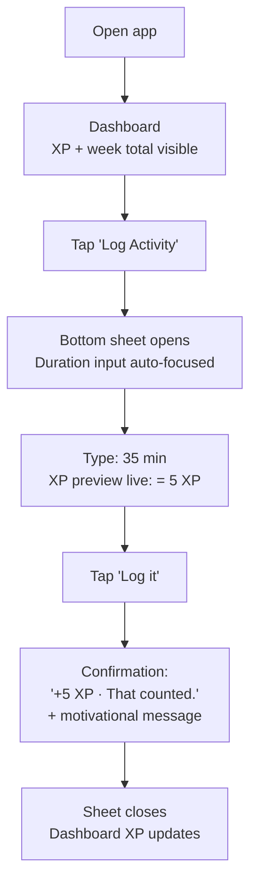
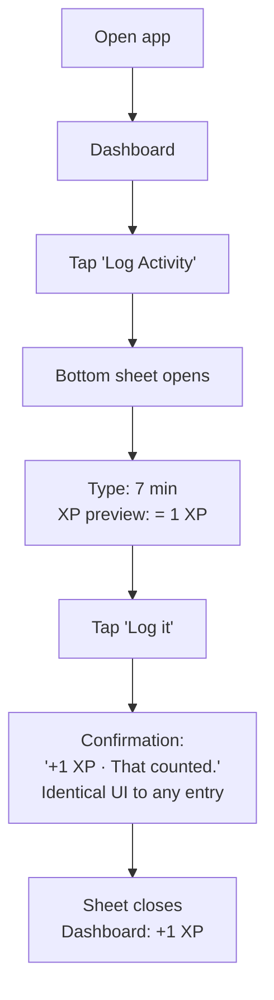
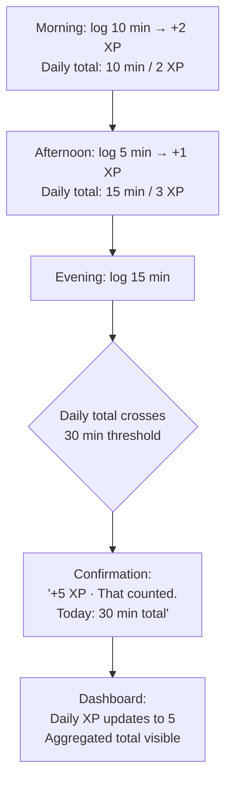
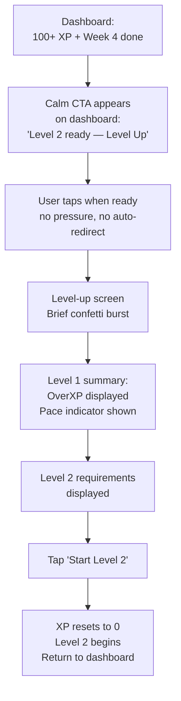

# UX Design Specification — It Counts

**Author:** Manuel
**Date:** 2026-04-07

---

<!-- UX design content will be appended sequentially through collaborative workflow steps -->

## Executive Summary

### Project Vision

It Counts is a personal movement tracking app built on one non-negotiable rule: every outdoor movement counts, always, without exception. It doesn't solve a fitness problem — it solves the cognitive overhead of self-judgment that makes leaving the apartment harder than it needs to be.

The app is deliberately anti-perfectionist: no streaks, no punishment for small entries, no visible achievement targets. XP is capped at 30 minutes intentionally — consistency is rewarded, not intensity. The 5-minute minimum is a pressure valve, not a consolation prize.

### Target Users

**V1:** Manuel — single user, personal use. Knows the pattern: ambitious start, perfectionism-induced stress, complete abandonment. Needs a system that makes no demands and never judges the size of an effort.

**Primary device:** Mobile (iPhone). Primary moment: on-the-go, just got home, wants to log before forgetting. Secondary: desktop dashboard review.

### Key Design Challenges

1. **Log speed vs. dual-input complexity** — The fast path (direct duration) and the precise path (start/end/non-walking time) must both feel quick and unintimidating on mobile, ideally one-handed.

2. **Small entry must feel valid** — A 7-minute walk = 1 XP. The UI must not make this feel small, incomplete, or insufficient. No tiny progress bar inching forward, no implicit "is that all?" signals.

3. **Fragmented day aggregation** — Three small trips summing to 30 min = 5 XP. This aggregation must be visible and satisfying, not bureaucratic. The user should feel rewarded for logging all three, not penalized for not doing it in one go.

4. **Level-up without pressure** — The level-up moment (4 weeks + 100 XP) should feel genuinely earned. No confetti overload, no "things get harder now" anxiety. Calm milestone, honest transition.

### Design Opportunities

1. **Log confirmation as the emotional core** — The moment immediately after logging is the most important micro-interaction in the entire app. This is where "yes, that counted" must land. Done right, it's a small but meaningful hit of validation.

2. **Dashboard as calm evidence** — Not a stats dashboard, not a gamification hub. A quiet, honest view of progress that doesn't create anxiety. The user should be able to open it and feel good, not pressured.

3. **History as proof** — The activity log is self-evidence. "I went outside 47 times since Level 1." Visible, chronological, permanent. No editing, no cleanup — it happened, it's there.

## Core User Experience

### Defining Experience

The core action is **logging an activity** — mobile, quick, without thinking. This single interaction carries the entire product. Everything else (dashboard, history, level-up) serves this loop.

The app opens to the Dashboard. The log form is immediately accessible without navigation — a bottom sheet or expandable section opens inline on the same view. No page change, no back button, no navigation stack to manage. Logging and progress overview are first-class peers on the same screen.

### Platform Strategy

- **Primary:** Mobile PWA (iOS Safari 16.4+, Android Chrome) — touch-based, one-handed, installed to homescreen
- **Secondary:** Desktop browser — same app, wider layout
- **Offline-first:** All logging works with no network. Service Worker + localStorage ensure no entry is ever blocked by connectivity.
- **No native app:** PWA covers the required use cases (homescreen install, offline, push notifications in V2)

### Effortless Interactions

- **Logging in < 30 seconds** — direct duration input is the default path; no mode selection required
- **Start/End/Non-Walking input** as an optional second path — never presented as the default, never in the way
- **No navigation required to log** — the form is always one tap away from the dashboard
- **Confirmation is immediate** — XP calculated and shown synchronously, no loading state in MVP

### Critical Success Moments

1. **Log confirmation** — the moment after submitting an entry. "That counted." Must be immediate, clear, and without judgment. 1 XP gets the same positive confirmation as 5 XP.
2. **Opening the dashboard** — the user opens the app not to log, but to see their progress. Must feel calm and satisfying, not pressuring.
3. **First 5 XP day** — the first time a full 30-minute day is logged and the top tier is hit. Should feel genuinely earned.
4. **Fragmented day total** — three small trips summing to a higher tier. The aggregation display should create a small moment of "oh, that actually adds up."

### Experience Principles

1. **Log first, navigate never** — The most important action needs no detour. Logging is always one tap away, inline on the main view.
2. **No judgment, no commentary** — The UI never comments on the size of an entry. 1 XP and 5 XP receive the same positive confirmation.
3. **Calm progression** — Progress is visible but never urgent. No red states, no "you're behind" signals, no negative feedback for missing the weekly target.
4. **Aggregation as a feature** — Multiple small entries summing to a higher tier should feel rewarding, not bureaucratic. Fragmentation is a first-class use case.
5. **Offline first** — The app always works. No network, no problem. No entry is ever lost.

## Desired Emotional Response

### Primary Emotional Goals

**Vindication without effort** — "That counted." Not a gamification rush, not explosive achievement. Just the quiet confirmation: _I went outside, it counts, done._

The emotional register of this app is deliberately calm. The one exception is level-up, which earns a genuine small celebration — brief confetti, a real moment of recognition — before returning to calm.

### Emotional Journey Mapping

| Moment | Target Feeling |
|--------|---------------|
| Opening the app | Inviting, no pressure |
| Filling in the log form | Focused, frictionless |
| Log confirmation | Validated — "yes, that counts" |
| Viewing the dashboard | Calm, grounded — progress without urgency |
| 1 XP entry | Neutral-positive — no "is that all?", no visual smallness |
| Fragmented day total | Mild pleasant surprise — "oh, that adds up" |
| Level-up | **Genuine small celebration** — brief confetti burst, earned satisfaction, then calm |

### Emotions to Avoid

- **Shame** — no negative feedback for small entries
- **Anxiety** — no "you're behind the target" messaging
- **Pressure** — no streak countdowns, no red warning states in normal use
- **Disappointment** — no implicit "that wasn't enough" through visual design

### Design Implications

- **Calm color palette** — no alarm red/orange in normal use states
- **Confirmation is always affirmative** — identical tone for 1 XP and 5 XP entries
- **No visual size hierarchy in history** — a 1 XP entry does not look smaller or lesser than a 5 XP entry
- **Motivational messages: never comparative** — never "you could have done more"
- **Animations: subtle by default** — no explosive celebrations except level-up; no overdone particle effects
- **Level-up confetti: brief burst** — short animation that completes and returns to calm; not looping, not overwhelming

### Emotional Design Principles

1. **Calm is the baseline** — the app's resting emotional state is quiet and grounded, never demanding
2. **Every entry is complete** — the confirmation moment must communicate finality and validity, not relative merit
3. **Celebrate milestones, not streaks** — level-up earns a moment; daily consistency does not require visible reward to feel meaningful
4. **Never trigger perfectionism** — any UI pattern that could create a "I should have done more" reaction must be redesigned or removed

## UX Pattern Analysis & Inspiration

### Inspiring Products Analysis

**Trakt.tv** — Manuel's primary reference. Clean, focused, content-forward. The app does one thing (tracking what you watch) without decorative overhead. Hierarchy is clear: the content you care about is front and center.

**Common failure mode in apps Manuel encounters:** disorganized, overloaded interfaces where core functionality is buried behind multiple menus and pages. Navigation becomes friction; the user has to work to do the thing they came to do.

### Transferable UX Patterns

**Flat Navigation:**
Everything is at most 1 tap from the main screen. No nested menus, no sub-navigation, no "settings > preferences > activity > logging mode" paths. It Counts has at most 3–4 navigation destinations total.

**Content First:**
No decorative chrome. Every UI element must justify its presence. If it doesn't help the user log, see progress, or understand their level — it shouldn't be there.

**Clear Information Hierarchy:**
The most important data is the most visually prominent. Not the most animated, not the most colorful — the most useful. On the dashboard: current XP and logging access outrank everything else.

**Single-Purpose Screens:**
Each view does one thing well. Dashboard = overview + log entry. History = past entries. Level-up = transition moment. No mixed-purpose screens that try to do too much.

### Anti-Patterns to Avoid

- **Tab bar with 5+ items** — It Counts needs ≤ 4 navigation destinations
- **Core action behind menus** — logging is inline on dashboard, never buried
- **Dashboard overload** — fewer widgets, more readable, more whitespace
- **Stacked modals** — one layer of overlay maximum; open once, close once
- **Gamification chrome everywhere** — badges, counters, streaks in every corner conflicts with the calm, anti-perfectionism design philosophy

### Design Inspiration Strategy

| | Pattern | Rationale |
|---|---------|-----------|
| **Adopt** | Flat navigation, single-purpose screens | Direct access, no search overhead |
| **Adopt** | Content-first, no decorative overhead | Supports calm, focused experience |
| **Adapt** | Trakt's list-heavy approach | Simpler content in It Counts → more whitespace, less density |
| **Avoid** | Gamification-heavy UI (badges, progress bars everywhere) | Contradicts anti-perfectionism philosophy |
| **Avoid** | Deep navigation hierarchies | Every extra tap is friction on a mobile logging app |

## Design System Foundation

### Design System Choice

**`@bubbles/ui` + shadcn/ui + Tailwind CSS v4** — the monorepo-wide design system, fully shared across all apps.

No design token work required for It Counts — everything is already in place.

### Color System

| Mode | Palette |
|------|---------|
| Dark | Catppuccin Mocha |
| Light | Catppuccin Latte |

Both palettes are fully defined in `@bubbles/ui/globals.css`. It Counts consumes them directly with zero app-level color definitions.

### Implementation Approach

| Layer | Source |
|-------|--------|
| Design tokens (colors, spacing, typography) | `@bubbles/ui/globals.css` |
| Component library | shadcn/ui (added via CLI only) |
| Theme toggle + dark/light switching | `@bubbles/theme` (next-themes + View Transitions) |
| App-specific overrides | `app/it-counts.css` (expected to be minimal or empty) |

### Customization Strategy

- shadcn components are installed via CLI, then styled using existing `@bubbles/ui` tokens — no manual component building
- No custom base components unless shadcn provides nothing suitable
- Typography defaults (h1–h6, paragraph sizes) come from `@bubbles/ui/globals.css` — never redefined per-component with Tailwind classes
- It Counts visual identity = Catppuccin palette + clean list-based layouts + purposeful whitespace

### Color Format Rule

**All colors must be defined in OKLCH — no exceptions.**

```css
/* ✅ correct */
color: oklch(0.7 0.15 250);
background: linear-gradient(to bottom, oklch(0.2 0.05 260), oklch(0.15 0.03 260));

/* ❌ never */
color: #7287fd;
color: rgb(114, 135, 253);
```

Applies to: design tokens in `@bubbles/ui/globals.css`, inline Tailwind arbitrary values, any CSS written in any app. OKLCH is perceptually uniform and produces significantly better gradients than RGB/HSL.

## Defining Core Experience

### Defining Experience

**Log a movement in under 30 seconds.**

This single interaction carries the entire product. The app is only as good as this moment. If this is fast, frictionless, and affirming — everything else follows.

### User Mental Model

Two natural starting points when returning from an outing:

1. "I was out for about 35 minutes" → direct duration input
2. "I left at 14:30, got back at 15:15, waited 10 minutes for the bus" → start/end/non-walking input

Both are valid. Neither is better. The UI must not imply a preference beyond presenting duration as the default (it's faster for most cases).

Current solution for most users: they don't log at all, or use generic notes apps, or try fitness trackers that demand GPS/steps/goals. It Counts asks for one number. That's the entire mental model shift.

### Success Criteria

- Log form opens without navigation — one tap from dashboard
- Duration input is the default, immediately focused on open
- XP preview updates live while typing (synchronous, no delay)
- Submit → confirmation in < 500ms
- Confirmation is final — no follow-up step required
- The user never has to think about which mode to use unless they want to

### Novel UX Patterns

**Inline on dashboard (novel for logging apps):** The log form opens as a bottom sheet directly on the dashboard — no page navigation, no back button. This is uncommon for logging-style apps but correct for this use case: the user sees their progress context while they log.

**Everything else is established:** number input, time picker, form submit, confirmation toast/message — all familiar patterns.

### Experience Mechanics

**1. Initiation:**
Prominent "Log Activity" tap target on dashboard. Bottom sheet slides up — dashboard content stays visible behind it. No page transition.

**2. Interaction:**
```
┌─────────────────────────────────┐
│  How long were you out?         │
│                                 │
│  [ 35 ] minutes                 │  ← default, auto-focused
│                                 │
│  [Use start / end time instead] │  ← secondary, subtle
│                                 │
│  [  Log Activity  ]             │
└─────────────────────────────────┘
```
XP tier displayed live: "= 5 XP" appears as soon as duration crosses a threshold.

**3. Feedback:**
Submit → immediate confirmation:
```
✓  35 min logged · +5 XP
   "That's another one. It counts."
```
XP progress bar on dashboard updates.

**4. Completion:**
Bottom sheet closes. Dashboard reflects new XP total. Done.

## Visual Design Foundation

### Color System

**Fully defined in `@bubbles/ui/globals.css` — no app-level color work needed.**

| Mode | Palette | CSS Variables |
|------|---------|---------------|
| Dark | Catppuccin Mocha | Already defined |
| Light | Catppuccin Latte | Already defined |

**Color format rule:** All values in OKLCH — `oklch(L C H)`. No hex, no RGB, no HSL. Applies to tokens, inline styles, and gradients without exception.

### Typography System

**Fonts defined in `@bubbles/ui/src/fonts.ts`, shared across all monorepo apps via Next.js font optimization.**

| Role | Font | Fallback |
|------|------|---------|
| Headings (h1–h6) | Montserrat | `system-ui, -apple-system, BlinkMacSystemFont, 'Segoe UI', sans-serif` |
| Body text | Poppins (400, 500, 600) | `system-ui, -apple-system, BlinkMacSystemFont, 'Segoe UI', sans-serif` |
| Code blocks | Fira Code | `ui-monospace, 'Cascadia Code', 'Source Code Pro', Menlo, Consolas, monospace` |

**Implementation pattern:**
```ts
// packages/ui/src/fonts.ts — exported, shared across all apps
export const montserrat = Montserrat({
  subsets: ['latin'], variable: '--font-heading', display: 'swap',
  fallback: ['system-ui', '-apple-system', 'BlinkMacSystemFont', 'Segoe UI', 'sans-serif'],
})
export const poppins = Poppins({
  subsets: ['latin'], weight: ['400', '500', '600'], variable: '--font-body', display: 'swap',
  fallback: ['system-ui', '-apple-system', 'BlinkMacSystemFont', 'Segoe UI', 'sans-serif'],
})
export const firaCode = Fira_Code({
  subsets: ['latin'], variable: '--font-code', display: 'swap',
  fallback: ['ui-monospace', 'Cascadia Code', 'Source Code Pro', 'Menlo', 'Consolas', 'monospace'],
})
```

```tsx
// Each app's layout.tsx
import { montserrat, poppins, firaCode } from '@bubbles/ui/fonts'
<html className={`${montserrat.variable} ${poppins.variable} ${firaCode.variable}`}>
```

Typography defaults (h1–h6 sizes, body line-height) defined once in `@bubbles/ui/globals.css` using `var(--font-heading)` and `var(--font-body)`. Never redefined per-component with Tailwind classes.

### Spacing & Layout Foundation

**Base unit:** 8px (Tailwind v4 default scale)

**Density:** Generous and spacious — mobile-first, content breathes. More whitespace between elements than Tailwind defaults where applicable.

**Layout principles:**
- Section-based layout, not card-based — cards only where genuine visual separation is needed
- Single-column on mobile, centered max-width on desktop
- Touch targets: use `touch-hitbox` utility class (defined in `@bubbles/ui/globals.css`)
- Inline log form (bottom sheet) does not push content — overlays dashboard

### Accessibility Considerations

- Color contrast: Catppuccin Mocha/Latte have been validated for WCAG compliance; no information conveyed by color alone
- Font sizes: minimum 16px body on mobile (no zoom-trigger)
- Touch targets: `touch-hitbox` utility class on all interactive elements (defined in `@bubbles/ui/globals.css`)
- All animations respect `prefers-reduced-motion`
- Semantic HTML + ARIA landmarks throughout (per NFR14–NFR15)

## Design Direction Decision

### Chosen Direction

**Direction 1 — Typography Hero**

The large XP number (e.g. "68 / 100 XP") dominates the dashboard as the primary visual anchor. Level context and week info are visible but secondary. The log action is one tap away via a prominent bottom sheet.

See interactive mockup: `ux-design-directions.html` → Direction 1

### Design Rationale

- The XP number is the one thing the user wants to know at a glance — making it typographically dominant serves the core use case
- Large Montserrat number = immediate readability on mobile without scanning
- Minimal surrounding chrome = calm, no cognitive overhead
- Bottom sheet log form = logging accessible without leaving the dashboard context
- Aligns with emotional goal: quiet, grounded progress view

### Component Strategy

**shadcn-first, two-layer approach:**

1. **shadcn primitives** — install via CLI only. Minimal changes: global concerns only (e.g. add `touch-hitbox` to every `Button` so all buttons meet touch target standard). Keep shadcn files close to original for easy upgrades.

2. **Custom components** — wrap shadcn as base, style and extend in own component files. App-specific design lives here, not in shadcn files.

| UI Element | shadcn Base | Custom Component |
|-----------|-------------|-----------------|
| Log bottom sheet | `Sheet` | `LogEntrySheet` |
| XP progress bar | `Progress` | `XpProgressBar` |
| Status chips | `Badge` | inline or `StatusChip` |
| Log button | `Button` | `LogActivityButton` |
| Time inputs | `Input` | `DurationInput`, `TimeRangeInput` |
| Motivational message | — | `MotivationalMessage` |

### Implementation Notes

- Dashboard XP number: Montserrat 800, large (64–80px mobile), `var(--ctp-text)`
- XP bar: 6px height, gradient `var(--ctp-blue) → var(--ctp-lavender)`, rounded
- Bottom sheet: slides up over dashboard content, handle indicator at top
- Log confirmation: inline within sheet before close, then sheet dismisses
- Bottom navigation: 3 items max (Dashboard · + · History)

## User Journey Flows

### Journey 1: The Normal Day

User logs a 35-minute outing. Primary success path.



### Journey 2: The Low-Energy Day

User logs a 7-minute walk. 1 XP. Identical confirmation tone.



No visual difference from a 5 XP confirmation. 1 XP is complete and valid.

### Journey 3: The Fragmented Day

Three separate entries throughout the day sum to 30 min = 5 XP.



The tier-jump at the third entry is a small moment of satisfaction — "oh, that adds up."

### Journey 4: The Level-Up

Both conditions met: 100+ XP and 4 full weeks elapsed.



### Journey Patterns

**Single-action confirmation** — every log confirmation is terminal; no follow-up step required.

**Inline XP preview** — XP tier shown live during input, before submission. No surprise after tapping Log.

**Accumulation visibility** — daily total shown in confirmation when a tier threshold is crossed mid-day.

**Non-judgmental parity** — 1 XP and 5 XP receive identical confirmation UI. No visual size difference in history entries.

**Error paths:**
- End time before start time → inline validation, field highlighted, submit blocked
- Non-walking time exceeds duration → inline validation, submit blocked
- No navigation away — errors resolve inline within the sheet

## Component Strategy

### shadcn Components (install via CLI, minimal changes)

Global changes applied to shadcn primitives directly:
- `Button` → add `touch-hitbox` class (every button needs it)
- All other shadcn files: no app-specific changes

shadcn components to install:
```bash
bunx shadcn@latest add sheet progress badge button input sonner
```

### Custom Components (wrap shadcn, styled in own files)

| Custom Component | shadcn Base | Purpose |
|-----------------|-------------|---------|
| `LogEntrySheet` | `Sheet` | Bottom sheet wrapping the log form |
| `DurationInput` | `Input` | Minutes input, auto-focused on sheet open |
| `TimeRangeInput` | `Input` ×3 | Start / end / non-walking time inputs |
| `XpProgressBar` | `Progress` | Gradient bar + "68 / 100 XP" label |
| `StatusBadge` | `Badge` | "On track", "Slightly over", "Well over" |
| `LogActivityButton` | `Button` | Primary log CTA |
| `MotivationalMessage` | — | Text-only confirmation + dashboard message |
| `OverXpIndicator` | `Badge` | Pace display on dashboard |
| `DailyGroup` | — | Day-level grouping in history |
| `WeeklyGroup` | — | Week-level grouping in history |
| `LevelBadge` | `Badge` | Level number, reused across views |

**Sonner** (`<Toaster />` in `layout.tsx`) — used for transient feedback only (log confirmation toast if needed). Not used for persistent indicators.

**Level-up eligibility:** no banner, no toast. When eligible (100 XP + 4 weeks), a calm `Button` CTA appears on the dashboard: "Level 2 ready — Level Up →". User navigates to `/level-up` when they choose. No pressure, no auto-redirect.

**Level-up page (`/level-up`):** standalone page with brief confetti, Level 1 summary, OverXP, Level 2 requirements, and a "Back to dashboard" button.

### Implementation Roadmap

**Phase 1 — Core logging loop**
- `LogEntrySheet`, `DurationInput`, `TimeRangeInput`
- `XpProgressBar`, `LogActivityButton`
- `MotivationalMessage`

**Phase 2 — Dashboard complete**
- `StatusBadge`, `OverXpIndicator`
- Level-up eligible CTA (conditional `Button`)
- Weekly summary section

**Phase 3 — History + Level-Up**
- `DailyGroup`, `WeeklyGroup`
- `/level-up` page + confetti
- `LevelBadge`

## UX Consistency Patterns

### Color Token Usage

**Always use semantic shadcn tokens — never raw Catppuccin tokens in components.**

| Role | Token | Notes |
|------|-------|-------|
| Primary action | `var(--primary)` | = Mauve (not blue) |
| Primary text on primary | `var(--primary-foreground)` | |
| Backgrounds | `var(--background)`, `var(--card)`, `var(--muted)` | |
| Text | `var(--foreground)`, `var(--muted-foreground)` | |
| Borders | `var(--border)` | |
| Success state | `var(--ctp-mocha-green)` / `var(--ctp-latte-green)` | No semantic token exists — use direct |
| Error/destructive | `var(--destructive)` | Already mapped |

Raw Catppuccin tokens (`var(--ctp-mocha-*)`) only when no semantic equivalent exists.

### What's already in `@bubbles/ui/globals.css`

- **Sonner** — already styled with Catppuccin colors for success/error toasts
- **View Transitions** — `circle-in` animation from bottom-left, respects `prefers-reduced-motion`
- **`touch-hitbox`** — implemented as `@utility`, use on all interactive elements
- **`--font-sans` / `--font-mono`** — currently placeholders, need replacing with Montserrat/Poppins/Fira Code when fonts are extracted to `@bubbles/ui/src/fonts.ts`

### Button Hierarchy

- **Primary** (`variant="default"`): one per screen/sheet max — "Log it", "Start Level 2"
- **Secondary/Ghost** (`variant="ghost"` or `variant="outline"`): optional alternatives — "Use start/end time instead"
- **Destructive**: not used in It Counts (no delete actions by design)
- All buttons: `touch-hitbox` class applied globally in shadcn `Button` component

### Feedback Patterns

- **Log confirmation**: inline within the Sheet after submit, before close — "+X XP · That counted." + motivational message. No separate toast.
- **Validation errors**: inline below the affected input field. Submit blocked until resolved. No modal, no toast, no navigation.
- **Level-up**: dedicated `/level-up` page — too much content for toast or modal.
- **Sonner**: used for system-level transient feedback only (e.g. future V2 AI errors). Not for log confirmations.

### Form Patterns

- **Dual-mode input** (duration / start+end): duration is default, auto-focused on sheet open. Secondary mode revealed via a subtle text link — never tabs or segmented control.
- **XP live preview**: appears as soon as a valid number is entered, before submit. Uses `var(--primary)` color.
- **Input labels**: always visible above the field — no placeholder-only labels.
- **Error state**: `var(--destructive)` border on affected input, error text below in `var(--destructive)` color.

### Navigation Patterns

- **Bottom nav**: max 3 items (Dashboard · + · History)
- **Page transitions**: View Transitions API — `circle-in` animation already in globals
- **Back navigation**: only on `/level-up` page — explicit "Back to dashboard" button
- **No deep navigation**: every destination is 1 tap from dashboard

### Empty States

- **No entries today**: `"Nothing logged yet today."` — neutral, no sad face, no prompt to log
- **No history at all**: brief explanation of what will appear here — friendly, not pressuring

### Loading States

- **MVP**: all synchronous — no loading states anywhere
- **V2 AI**: spinner scoped to AI parse area only, never global overlay

## Responsive Design & Accessibility

### Responsive Strategy

**MVP: mobile-only layout, desktop usable.**

| Breakpoint | Layout | Notes |
|-----------|--------|-------|
| Mobile (default) | Single-column, full width, bottom nav, bottom sheet | Primary experience |
| Desktop (`lg:`) | Centered, `max-w-md` (~430px), same layout | No structural changes — just centered |

No multi-column, no sidebar, no layout redesign between breakpoints. It Counts is a mobile app that happens to work on desktop.

**Post-MVP (V2/V3):** Desktop-optimized layout as a future extension — wider content area, possible sidebar for history. Not in scope for V1.

### Breakpoint Strategy

Tailwind v4 standard breakpoints, mobile-first:
- No prefix → mobile (default)
- `sm:` (640px) → minor adjustments only
- `lg:` (1024px) → center + constrain width

### Accessibility Strategy

**Target: WCAG AA**

| Requirement | Implementation |
|------------|---------------|
| Color contrast | Catppuccin Mocha/Latte validated for WCAG AA |
| Touch targets | `touch-hitbox` utility on all interactive elements |
| Keyboard navigation | shadcn components include keyboard support by default |
| Screen reader | Semantic HTML + ARIA landmarks throughout |
| Motion | `prefers-reduced-motion` handled in `@bubbles/ui/globals.css` for View Transitions — applies to all animations |
| Color-only information | Never — OverXP indicator uses text label + color |
| Font sizes | Minimum 16px body (prevents iOS auto-zoom) |

### Testing Strategy

**MVP (manual):**
- VoiceOver on iOS (primary PWA platform)
- Keyboard-only navigation check before each feature ship
- Browser DevTools Accessibility panel audit

**Not for MVP:** automated a11y testing suite (app too small to justify overhead)
