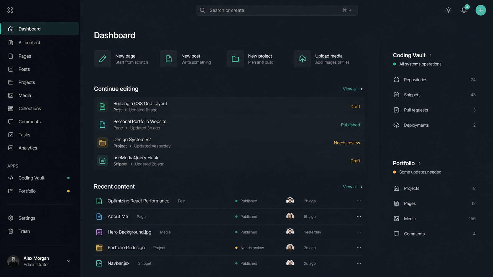
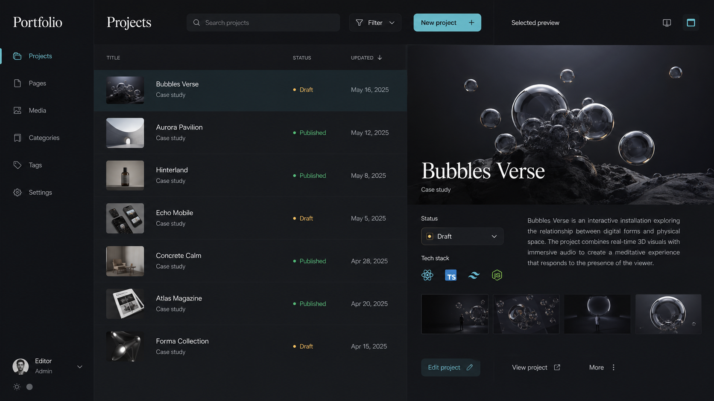
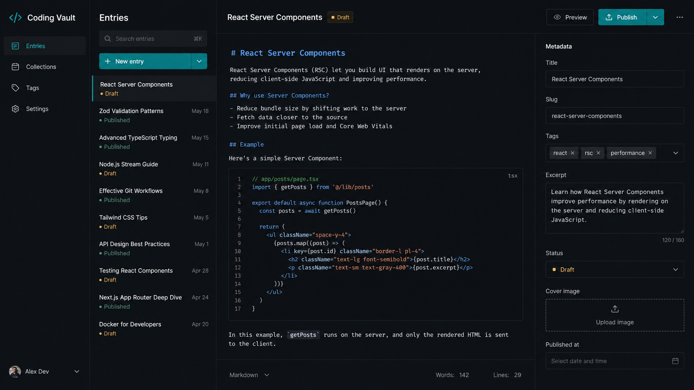

# Calm Creative Dashboard Visual Spec

Stand: 2026-04-26
Status: Designrichtung vor Umsetzung
Scope: `apps/dashboard`

## Ziel

Das Dashboard soll ein ruhiges Admin-Tool bleiben, aber stärker wie ein
modernes Content-Studio wirken. Die Umsetzung orientiert sich an den
generierten Richtungen:

- Dashboard Home: dunkles Command Center.
- Portfolio-Unterseiten: editorialer Listen- und Preview-Split.
- Coding Vault: editornahe Werkbank mit Listen, Editor und Metadaten.

Die bestehenden globalen Farben, Fonts und Theme-Tokens aus `@bubbles/ui`
bleiben die visuelle Quelle der Wahrheit. Mockup-Farben sind nur
Stimmungsreferenz.

## Visual References

Diese Mockups sind Referenzen für Layout, Dichte, Oberflächenlogik und
Stimmung. Farben, Fonts und konkrete Komponenten werden aus dem bestehenden
`@bubbles/ui`-System übersetzt.

## Binding Constraints

- Keine globale Farbpalette ersetzen.
- Keine globale Font-Umstellung im Rahmen dieses Dashboard-Redesigns.
- Kein Umbau von `@bubbles/ui`, außer ein kleiner, klar begründeter Primitive
  oder Variant später wirklich mehrfach gebraucht wird.
- Keine Card-in-card-Struktur.
- Wenige Trennlinien; Hierarchie entsteht über Fläche, Abstand, Typografie und
  Statussignale.
- Mobile first als Arbeitsmethode, nicht als Entschuldigung für schwache
  Desktop-Layouts.
- Vorhandene shadcn-Komponenten aus `@bubbles/ui` bleiben die Basis.

## Design Haltung

Das Dashboard ist ein Content Operating System für mehrere Apps. Es soll nicht
wie ein Analytics-Dashboard wirken, sondern wie ein Arbeitsraum:

- klare Sidebar
- ruhige Topbar mit Suche oder Command-Einstieg
- große Arbeitsflächen statt Widget-Sammlung
- Listen mit Vorschau statt reiner Tabellen, wenn Inhalte kreativ sind
- echte Tabellen dort, wo Verwaltung und Vergleich wichtiger sind
- dezente App-Akzente für Orientierung, nicht als neue Farbsysteme

## Token Strategie

### Farben

Alle Farben kommen aus den bestehenden CSS-Variablen und Tailwind-Tokens:

- `background`
- `foreground`
- `card`
- `muted`
- `muted-foreground`
- `border`
- `primary`
- `secondary`
- `accent`
- `sidebar`

Dashboard-spezifische CSS-Klassen dürfen diese Tokens neu kombinieren, aber
keine parallele Palette einführen. Beispiel: eine Studio-Fläche darf
`bg-card/70`, `bg-muted/30`, `shadow-black/10` oder `border-border/40` nutzen.
Sie darf aber keine hardcodierten Mockup-Farben als neue Wahrheit setzen.

### Typography

Die Fonts bleiben global über `@bubbles/ui`:

- `font-sans`
- `font-heading`
- `font-body`
- `font-code`

Das Dashboard darf lokale typografische Hilfsklassen in
`apps/dashboard/app/dashboard.css` definieren, wenn sie nur vorhandene
Font-Familien und Token-basierte Farben nutzen.

Geeignete erste Hilfsklassen:

- `dashboard-kicker`
- `dashboard-title`
- `dashboard-section-title`
- `dashboard-body`
- `dashboard-meta`

Diese Klassen dienen als Testfeld. Wenn sie sich bewähren, können sie später
als shared typography recipe nach `@bubbles/ui` wandern. Das ist nicht Teil der
ersten Umsetzung.

## Layout Patterns

### Responsive Quality

`Mobile first` bedeutet: erst die kleinste sinnvolle Nutzungsform sauber lösen
und dann schrittweise auf größere Viewports erweitern. Es bedeutet nicht, dass
Tablet, Laptop oder Desktop vernachlässigt werden dürfen.

Das Dashboard muss auf allen Bildschirmgrößen nutzbar und hochwertig wirken.
Da die Hauptnutzung voraussichtlich auf Desktop passiert, ist Desktop die
ausgereifteste Variante:

- Mobile: vollständig nutzbar, klare Stapelung, keine verdeckten Kernaktionen.
- Tablet: nutzbar ohne gequetschte Zwischenzustände.
- Laptop: produktive Standardansicht mit guter Dichte.
- Desktop: Magnum Opus mit der besten Raumnutzung, stärkster Hierarchie und
  vollständigster Arbeitsfläche.

Responsive Design ist hier progressive Anreicherung: mobile Struktur zuerst,
Desktop-Ausdruck zuletzt und am stärksten ausgearbeitet.

### Dashboard Home

Zielbild: Command Center.

Struktur:

- kompakter Header mit Greeting, Statuszeile und globaler Aktion
- Command/Search-Bar als primärer Einstieg
- Hauptfläche `Continue editing` mit offenen Drafts und recent updates
- Quick-create als kurze Aktionsreihe
- App-Status für Coding Vault, Portfolio und spätere Apps
- rechte Rail nur für leichte Kontextflächen

Wichtig:

- keine isolierte Hero-Card
- keine Charts als Primärinhalt
- kein Raster aus gleich schweren Karten
- große Flächen dürfen ungerahmt oder nur tonwertig abgesetzt sein

### Coding Vault

Zielbild: produktive Werkbank.

Struktur:

- Entry-Liste oder Queue links
- Editor oder ausgewählte Arbeitsfläche zentral
- Metadaten, Status und Publishing rechts
- Preview-Aktion prominent, aber nicht lauter als Speichern

Die bestehende Editor-Integration bleibt erhalten. Das Redesign konzentriert
sich zuerst auf Shell, Overview, Listen und Seitenrahmen.

### Portfolio

Zielbild: editorialer Preview-Split.

Struktur:

- Projektliste links
- große Preview rechts
- Tech Stack, Status und Veröffentlichungszustand direkt am Objekt
- weniger tabellarisch als Vault, weil Portfolio-Inhalte stärker visuell sind

Portfolio-CRUD ist ein späteres Modul. Für die erste Dashboard-Umsetzung reicht
es, das Pattern als Zielrichtung festzuhalten.

## Component Strategy

Im Dashboard starten:

- `dashboard.css` für app-spezifische Layout- und Typography-Rezepte
- bestehende Home- und Vault-Komponenten gezielt anpassen
- `BubblesSidebarLayout` über vorhandene `classNames` stylen
- shadcn `Button`, `Tabs`, `Badge`, `Input`, `Tooltip`, `Table` weiter nutzen

### Shadcn First Rule

Für jede neue UI-Funktion gilt diese Reihenfolge:

1. Zuerst prüfen, ob es die passende shadcn-basierte Komponente bereits in
   `@bubbles/ui` gibt.
2. Wenn nicht, über die offizielle shadcn CLI prüfen, ob die Komponente in der
   Registry verfügbar ist.
3. Wenn verfügbar, per offizieller shadcn CLI in das passende Package
   hinzufügen.
4. Neue app-eigene Komponenten danach auf dieser shadcn-Basis komponieren.

Nicht erlaubt:

- Komponenten aus den shadcn Docs manuell nachbauen.
- Registry-Code per Copy/Paste oder Raw-Download übernehmen.
- Eigene Controls, Dialoge, Menüs, Tabellen, Tabs, Badges, Skeletons, Alerts,
  Tooltips oder Formularfelder aus Default-HTML und Utility-Klassen bauen, wenn
  es dafür eine shadcn-Komponente in der Monorepo oder Registry gibt.

Semantische HTML-Tags wie `main`, `section`, `header`, `h1`, `p`, `ul` und
`li` bleiben für Dokumentstruktur und einfache Content-Struktur erlaubt. Sobald
ein Element aber eine UI-Funktion, Interaktion, Datenoberfläche oder
Feedback-State abbildet, hat eine vorhandene oder installierbare
shadcn-Komponente absolute Priorität.

Nicht starten mit:

- neuem globalem Designsystem
- komplettem `@bubbles/ui`-Umbau
- generischem Resource-Renderer
- Portfolio-Datenmodell, solange Home und Vault noch nicht sitzen

## Implementation Slice

Empfohlener erster Slice:

1. Dashboard CSS-Rezepte für Studio-Flächen, Command-Bar und Typografie.
2. AppShell auf das Command-Center-Gefühl abstimmen.
3. Dashboard Home wie Mockup-Richtung 1 umbauen.
4. Vault Overview näher an Mockup-Richtung 3 bringen.
5. README und Changelog scoped zu `apps/dashboard` aktualisieren.

Danach:

1. Vault Entries und Editor-Routen als Werkbank verfeinern.
2. Portfolio-Modul als eigene App-Sektion planen.
3. Wiederholte Dashboard-Rezepte prüfen und nur bei echtem Nutzen nach
   `@bubbles/ui` heben.

## Akzeptanzkriterien

- Dark Mode fühlt sich wie die primäre Erfahrung an.
- Light Mode bleibt sauber, nutzt dieselben Tokens und wirkt nicht wie ein
  komplett anderes Produkt.
- Keine neue hardcodierte Farbwelt entsteht.
- Alle relevanten Viewport-Breiten bleiben nutzbar; Desktop ist als
  Hauptnutzung die stärkste und sorgfältigste Ausprägung.
- Dashboard Home ist klar als Arbeitszentrale erkennbar.
- Vault bleibt schneller Arbeitsbereich, nicht Marketing-Seite.
- Unterseiten dürfen unterschiedlich aussehen, solange Shell, Tokens,
  Typografie und Interaktionsmuster konsistent bleiben.
- Dateien bleiben fokussiert; größere Splits nur bei echten
  Verantwortungsgrenzen.
